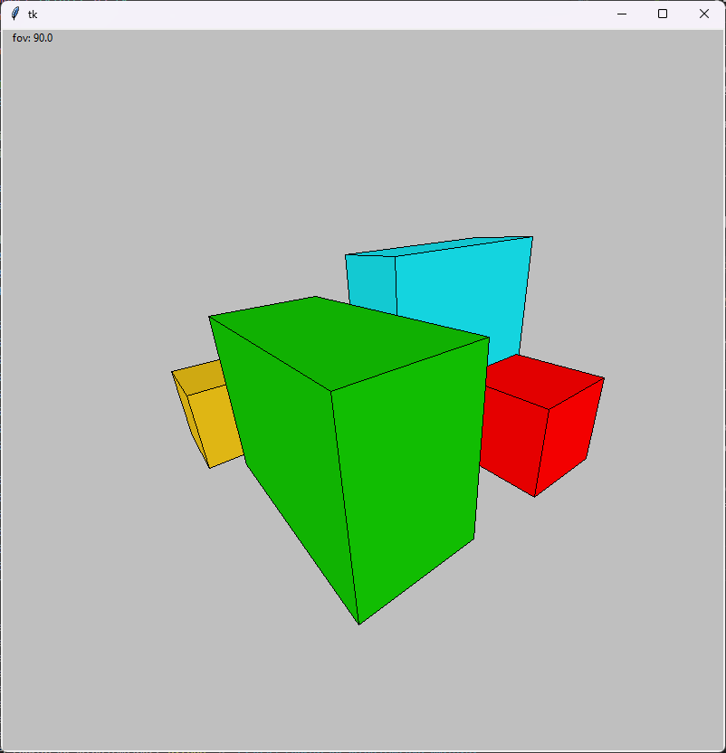
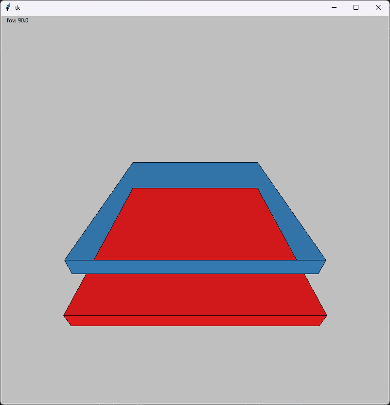
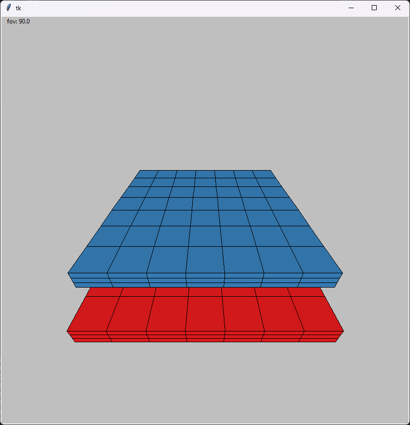

# GK - projekt 2 - Eliminacja elementów zasłoniętych
Projekt z kursu Grafika Komputerowa na Politechnice Warszawskiej w semestrze letnim 2024. Celem projetu było zaimplementowanie jednego z algorytmów eliminacji elementów zasłoniętych. W tym projekcie użyty został algorytm malarski.

Sam algorytm malarski jest zbyt prosty żeby zaliczyć projekt. Może on powodować wyświetlanie niektórych płaszczyzn w złej kolejności. Aby temu zapobiec dodałem możliwość dzielenia czworokątów na mniejsze. 

 Program bazuje na projekcie nr 1.

## Uruchomienie
``pip install -r requirements.txt``

``python main.py``

## Sterowanie:
↑ ↓ 	- ruch wyżej / niżej (względem osi y)\
←→  	- ruch prawo / lewo (względem osi x)\
z x	- ruch bliżej / dalej (względem osi z)\
a d 	- obrót względem osi y\
w s	- obrót względem osi x\
q e 	- ogrót względem osi z\
r f	- zmiana kąta widzenia (jego wartość wyświetlana jest w lewym górnym rogu ekranu)

## Zrzuty ekranu

